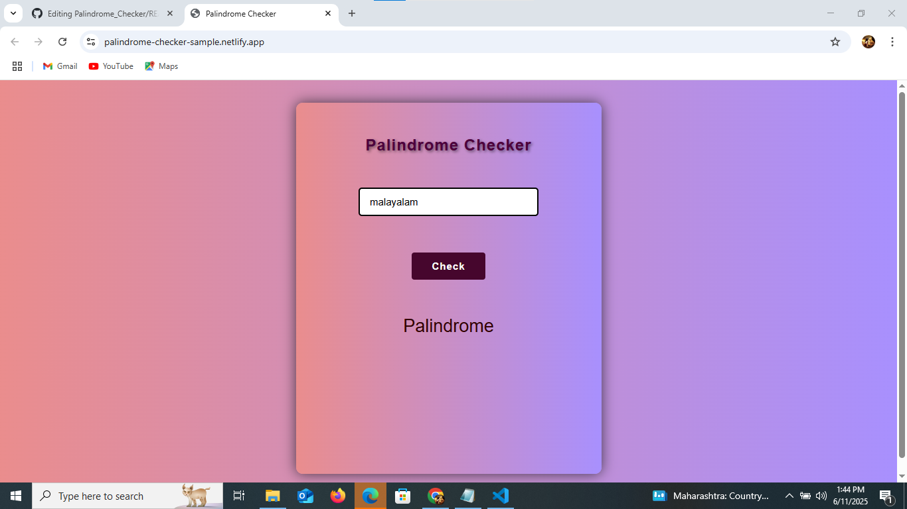
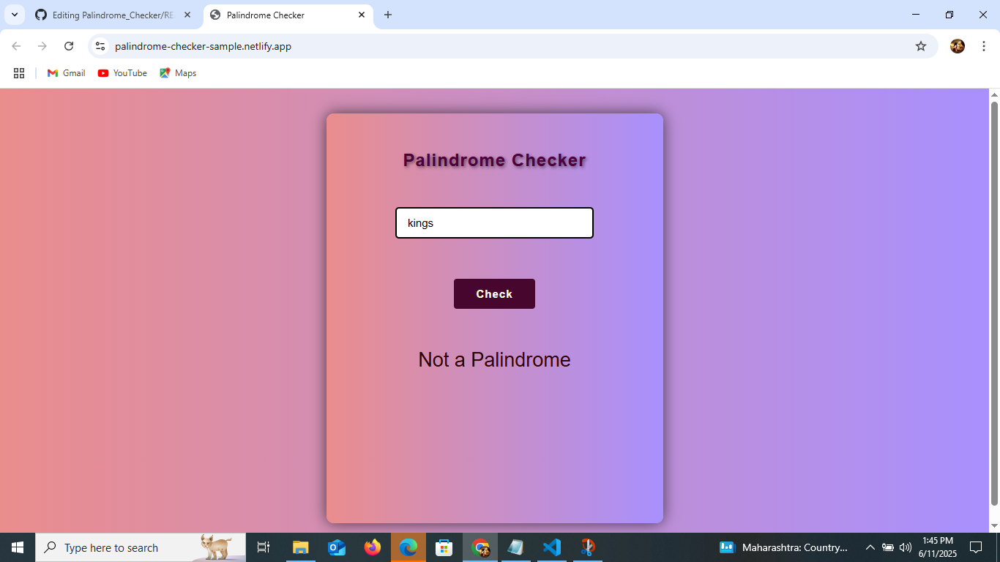

# Palindrome Checker

A simple and interactive **Palindrome Checker** built using **HTML**, **CSS**, and **JavaScript**. This tool checks whether a given sentence or word is a palindrome—ignoring case, punctuation, and spaces.

## Demo

[Live Demo](https://palindrome-checker-sample.netlify.app/)  

## Developed By
**Gayathri G**  
GitHub: [GAYATHRI1006](https://github.com/GAYATHRI1006)

## Screenshot

  
  

## Features

- Checks if the input is a **palindrome**
- Ignores spaces, special characters, and letter casing
- Simple and clean interface
- Input validation for empty fields

## How to Use

1. Open `index.html` in your browser.
2. Enter a word or sentence.
3. Click **Check**.
4. Result will show either:
   - `"Palindrome"` or
   - `"Not a Palindrome"`

##  Logic Used

- Input is converted to lowercase
- All non-alphanumeric characters are removed
- The string is reversed and compared with the original cleaned version

### Example
Input: A man, a plan, a canal, Panama
→ Cleaned: amanaplanacanalpanama
→ Reversed: amanaplanacanalpanama
→ Result: Palindrome

## Input Validation

- If the input field is empty:  
  `Please enter an input`

## Technologies Used

- **HTML** – Structure
- **CSS** – External stylesheet for styling
- **JavaScript** – Logic for checking palindrome and displaying the result
